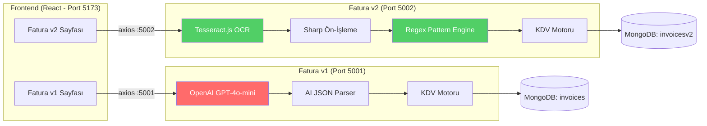

# 🧾 Fatura 2 — Yerli OCR Mikroservisi (invoice-ocr-v2)

> **Hedef:** Mevcut OpenAI tabanlı fatura servisine dokunmadan, tamamen bağımsız ve dışa bağımlılıksız bir Tesseract.js + Regex Parser tabanlı ikinci fatura modülü oluşturmak. İki sistem yan yana çalışarak karşılaştırma yapılabilecek.

---

## 📊 Mevcut vs. Yeni: Karşılaştırma

| Özellik | Fatura v1 (`invoice-ocr-service`) | Fatura v2 (`invoice-ocr-v2`) |
|---|---|---|
| Port | 5001 | **5002** |
| OCR Motoru | OpenAI GPT-4o-mini Vision | **Tesseract.js (Lokal)** |
| Parser | AI JSON çıktısı parse | **Kendi Regex Pattern Engine** |
| Dış API Bağımlılığı | ✅ OpenAI API Key gerekli | **❌ Sıfır — Tamamen lokal** |
| Aylık Maliyet | API kullanımına göre değişken | **₺0 — Ücretsiz** |
| KDV Motoru | vatCalculator.js | **Aynı — yeniden kullanılacak** |
| Doğrulama | vatCalculator cross-check | **Aynı — yeniden kullanılacak** |
| MongoDB Koleksiyonu | `invoices` | **`invoicesv2`** |

---

## Open Questions

> [!IMPORTANT]
> **Tesseract Dil Paketi**: Tesseract.js ilk çalıştırmada Türkçe dil verisini (~4MB) otomatik indirir ve cache'ler. Sonraki çalışmalarda internet gerekmez. Bu yaklaşım uygun mu, yoksa dil paketini projeye gömmeyi (offline) tercih eder misiniz?

---

## 🏗️ Yeni Modül Dosya Yapısı

```
Micro-CRM/
├── invoice-ocr-service/        ← DOKUNULMAZ (Mevcut - OpenAI)
│   └── ...                     
│
├── invoice-ocr-v2/             ← YENİ — Yerli OCR Mikroservisi
│   ├── config/
│   │   └── index.js            # Konfigürasyon (port, mongo, tesseract ayarları)
│   │
│   ├── controllers/
│   │   └── invoiceController.js  # API handler'ları (v1 ile aynı interface)
│   │
│   ├── middleware/
│   │   ├── errorHandler.js     # Hata yönetimi (v1'den kopyalanacak)
│   │   └── upload.js           # Multer dosya yükleme (v1'den kopyalanacak)
│   │
│   ├── models/
│   │   └── Invoice.js          # Mongoose şeması (v1 ile aynı + ocrEngine alanı)
│   │
│   ├── services/
│   │   ├── ocrService.js       # Tesseract.js OCR motoru
│   │   ├── imagePreprocessor.js  # Sharp ile görüntü ön-işleme
│   │   └── invoiceParser.js    # Türkçe fatura regex pattern engine
│   │
│   ├── utils/
│   │   ├── vatCalculator.js    # KDV motoru (v1'den birebir kopyalanacak)
│   │   ├── validators.js       # Doğrulama (v1'den kopyalanacak)
│   │   └── constants.js        # Sabitler (v1'den kopyalanacak)
│   │
│   ├── tests/
│   │   ├── vatCalculator.test.js   # KDV testleri (v1'den kopyalanacak)
│   │   └── invoiceParser.test.js   # Regex parser unit testleri (YENİ)
│   │
│   ├── uploads/                # Yüklenen fatura dosyaları
│   ├── .env.example            # Ortam değişkenleri
│   ├── .env                    # Gerçek konfigürasyon
│   ├── server.js               # Express sunucu (port 5002)
│   ├── package.json            # Bağımlılıklar
│   └── README.md               # Modül dokümantasyonu
```

---

## Proposed Changes

### Bileşen 1: invoice-ocr-v2 Backend (Yeni Mikroservis)

---

#### [NEW] `invoice-ocr-v2/package.json`

Bağımlılıklar — hiçbir dış AI servisi yok:
```json
{
  "name": "invoice-ocr-v2",
  "version": "1.0.0",
  "description": "Yerli OCR Fatura Servisi — Tesseract.js + Regex Parser (Dışa Bağımlılık Sıfır)",
  "dependencies": {
    "cors": "^2.8.5",
    "dotenv": "^16.4.7",
    "express": "^4.21.2",
    "express-validator": "^7.2.1",
    "mongoose": "^8.9.5",
    "multer": "^1.4.5-lts.1",
    "sharp": "^0.33.5",
    "tesseract.js": "^6.0.1"
  },
  "devDependencies": {
    "jest": "^29.7.0"
  }
}
```

**Kaldırılan paketler**: `openai`, `@anthropic-ai/sdk` → **Sıfır dış AI bağımlılığı** ✅

---

#### [NEW] `invoice-ocr-v2/config/index.js`

```javascript
// OpenAI API key YOK — sadece yerel konfigürasyon
const config = {
  port: 5002,          // v1=5001, v2=5002
  mongoUri: process.env.MONGO_URI,
  ocr: {
    language: 'tur',   // Tesseract Türkçe dil paketi
    psm: 6,            // Page Segmentation Mode: Tek blok metin
  },
  upload: { ... },     // v1 ile aynı
  vat: { tolerance: 30.00 },
};
```

---

#### [NEW] `invoice-ocr-v2/services/imagePreprocessor.js`

OCR doğruluğunu artırmak için fatura görselini Sharp ile ön-işleme:

```javascript
// Pipeline: Orijinal Görsel → Grayscale → Contrast ↑ → Threshold → OCR'a hazır
async function preprocessForOCR(inputPath) {
  const outputPath = inputPath.replace(/(\.\w+)$/, '-processed.png');
  await sharp(inputPath)
    .grayscale()                    // Renkleri kaldır
    .normalise()                    // Kontrast normalleştirme
    .sharpen({ sigma: 1.5 })       // Kenarları keskinleştir
    .threshold(140)                 // Siyah-beyaz eşikleme
    .png()                          // PNG olarak kaydet (kayıpsız)
    .toFile(outputPath);
  return outputPath;
}
```

---

#### [NEW] `invoice-ocr-v2/services/ocrService.js`

Tesseract.js ile yerel OCR — **OpenAI API yerine**:

```javascript
const Tesseract = require('tesseract.js');
const { preprocessForOCR } = require('./imagePreprocessor');
const { parseInvoiceText } = require('./invoiceParser');

async function processInvoice(filePath, mimeType) {
  // 1. Görüntüyü OCR için optimize et
  const processedPath = await preprocessForOCR(filePath);
  
  // 2. Tesseract ile metin çıkar (Türkçe)
  const { data: { text, confidence } } = await Tesseract.recognize(
    processedPath, 'tur',
    { logger: m => console.log(`[OCR] ${m.status}: ${Math.round(m.progress * 100)}%`) }
  );
  
  // 3. Kendi regex parser'ımız ile yapılandırılmış veri çıkar
  const parsed = parseInvoiceText(text);
  parsed.confidenceScore = Math.round(confidence);
  parsed.rawText = text; // Debug için ham metin sakla
  
  return parsed;
}
```

---

#### [NEW] `invoice-ocr-v2/services/invoiceParser.js` ⭐ Kritik Dosya

Türkçe fatura metinlerinden yapılandırılmış veri çıkaran kendi regex motorumuz:

```javascript
/**
 * Türkçe Fatura Regex Pattern Engine
 * 
 * Stratejimiz: Tesseract'tan gelen ham metni satır satır tarıyoruz.
 * Her satırı bilinen Türkçe fatura kalıplarıyla (pattern) eşleştiriyoruz.
 * Bulunan alanlardan yapılandırılmış bir fatura objesi oluşturuyoruz.
 */

// ——— Ana Alan Kalıpları ———
const PATTERNS = {
  // Satıcı bilgileri
  vendorName:    /(?:ÜNVANI?|FİRMA|SATICI|AD[IİI]?\s*SOYAD[IİI]?)\s*[:\-]?\s*(.+)/i,
  taxNumber:     /(?:VKN|V\.?K\.?N\.?|VERGİ\s*(?:NO|NUMARASI|KİMLİK))\s*[:\-]?\s*(\d{10,11})/i,
  invoiceNumber: /(?:FATURA\s*(?:NO|NUMARASI|NUM)|SERİ\s*(?:NO|SIRA)|BELGE\s*NO)\s*[:\-]?\s*([A-ZÇĞİÖŞÜ0-9\-\/]+)/i,
  invoiceDate:   /(?:TARİH|DÜZENLENME\s*TARİHİ|FATURA\s*TARİH)\s*[:\-]?\s*(\d{1,2}[.\/\-]\d{1,2}[.\/\-]\d{2,4})/i,
  
  // Toplam değerler
  grandTotal:    /(?:GENEL\s*TOPLAM|G\.?\s*TOPLAM|TOPLAM\s*TUTAR|ÖDENECEK|NET\s*TOPLAM)\s*[:\-]?\s*[*]?([\d.,]+)\s*(?:TL|₺)?/i,
  baseAmount:    /(?:MATRAH|KDV\s*HARİÇ|ARA\s*TOPLAM|TOPLAM\s*MATRAH)\s*[:\-]?\s*[*]?([\d.,]+)\s*(?:TL|₺)?/i,
  
  // KDV bilgileri
  kdvRate:       /(?:%\s*|KDV\s*(?:ORAN[IİI]?|%)\s*[:\-]?\s*)(\d{1,2})/i,
  kdvAmount:     /(?:KDV\s*(?:TUTAR[IİI]?|TOPLAM[IİI]?)|HESAPLANAN\s*KDV)\s*[:\-]?\s*[*]?([\d.,]+)\s*(?:TL|₺)?/i,
  
  // Satır kalemleri (tablo satırları)
  lineItem:      /^(.+?)\s+(\d+(?:[.,]\d+)?)\s+(?:Adet|AD|adet)?\s*([\d.,]+)\s+([\d.,]+)\s+%?(\d{1,2})\s+([\d.,]+)\s+([\d.,]+)/,
};

function parseInvoiceText(rawText) {
  const lines = rawText.split('\n').map(l => l.trim()).filter(Boolean);
  
  // Her pattern'ı tüm satırlarda ara
  const result = {
    vendorName: '', vendorTaxNumber: '', invoiceNumber: '',
    invoiceDate: null, lineItems: [], grandTotal: 0, confidenceScore: 0
  };
  
  // 1. Header alanlarını bul
  for (const line of lines) {
    for (const [field, pattern] of Object.entries(PATTERNS)) {
      if (field === 'lineItem') continue;
      const match = line.match(pattern);
      if (match && !result[field]) {
        result[field] = match[1].trim();
      }
    }
  }
  
  // 2. Satır kalemlerini ayıkla
  result.lineItems = extractLineItems(lines);
  
  // 3. Sayısal değerleri normalize et
  result.grandTotal = parseAmount(result.grandTotal);
  // ... (baseAmount, kdvAmount normalize)
  
  // 4. Confidence: Kaç alan bulundu?
  const foundFields = Object.values(result).filter(v => v && v !== 0).length;
  result.confidenceScore = Math.round((foundFields / 7) * 100);
  
  return normalizeInvoiceData(result);
}
```

---

#### [NEW] `invoice-ocr-v2/models/Invoice.js`

v1 ile **birebir aynı şema** + `ocrEngine` alanı:

```javascript
// Ekstra alan: Hangi motorla işlendiğini işaretler
ocrEngine: {
  type: String,
  enum: ['tesseract-v2', 'openai-v1'],
  default: 'tesseract-v2',
}
// Ayrı koleksiyon: 'invoicesv2' (v1 ile karışmaması için)
```

---

#### [NEW] `invoice-ocr-v2/controllers/invoiceController.js`

v1 ile **aynı API interface** — frontend aynı komponentleri kullanabilir:
- `uploadSingleInvoice` — Tek fatura yükle + Tesseract OCR
- `bulkUploadInvoices` — Toplu yükleme (sıralı işleme)
- `getAllInvoices` — Listeleme + pagination
- `getInvoiceById` — Detay
- `updateInvoice` — Manuel düzeltme
- `deleteInvoice` — Silme
- `getInvoiceStats` — İstatistikler

---

#### [NEW] `invoice-ocr-v2/server.js`

```javascript
// Port 5002 — v1 (5001) ile çakışmaz
app.listen(5002, () => {
  console.log('🧾 Invoice OCR v2 (Tesseract) running on port 5002');
});
```

---

#### Kopyalanacak Dosyalar (v1 → v2, birebir)

Bu dosyalar zaten mükemmel çalışıyor, değiştirmeye gerek yok:

| Dosya | Neden |
|---|---|
| `utils/vatCalculator.js` | KDV motoru evrensel — motordan bağımsız |
| `utils/validators.js` | Dosya/veri doğrulama evrensel |
| `utils/constants.js` | Sabitler aynı |
| `middleware/errorHandler.js` | Hata yönetimi aynı pattern |
| `middleware/upload.js` | Multer konfigürasyonu aynı |
| `tests/vatCalculator.test.js` | KDV testleri aynı |

---

### Bileşen 2: Frontend Değişiklikleri

---

#### [NEW] `frontend/src/services/invoiceV2Service.js`

```javascript
// Port 5002'ye bağlanan ayrı axios instance
const invoiceV2Api = axios.create({
  baseURL: 'http://localhost:5002/api',
});

// v1 ile birebir aynı metod isimleri
const invoiceV2Service = {
  upload: (file) => { ... },
  bulkUpload: (files) => { ... },
  getAll: (params) => { ... },
  getById: (id) => { ... },
  update: (id, data) => { ... },
  delete: (id) => { ... },
  getStats: () => { ... },
};
```

---

#### [NEW] `frontend/src/pages/InvoicesV2.jsx`

Mevcut `Invoices.jsx` ile **aynı UI** — sadece `invoiceService` yerine `invoiceV2Service` kullanacak. Sayfa başlığında "Fatura v2 — Yerli OCR (Tesseract)" yazacak.

---

#### [MODIFY] [Sidebar.jsx](file:///c:/Users/selam/Desktop/Micro-CRM/frontend/src/components/layout/Sidebar.jsx)

Finans bölümüne yeni menü öğesi:

```diff
 const financeItems = [
   { path: '/invoices', icon: <HiOutlineDocumentText />, label: t('nav.invoices') },
+  { path: '/invoices-v2', icon: <HiOutlineBeaker />, label: t('nav.invoicesV2') },
 ];
```

---

#### [MODIFY] [App.jsx](file:///c:/Users/selam/Desktop/Micro-CRM/frontend/src/App.jsx)

Yeni route eklenmesi:

```diff
 <Route path="/invoices" element={<Invoices />} />
+<Route path="/invoices-v2" element={<InvoicesV2 />} />
```

---

#### [MODIFY] `frontend/src/i18n/tr.json` ve `en.json`

```json
{
  "nav": {
    "invoicesV2": "Fatura v2 (Yerli OCR)"  // TR
    "invoicesV2": "Invoices v2 (Local OCR)" // EN
  }
}
```

---

### Bileşen 3: Root Proje Yapılandırması

---

#### [MODIFY] [package.json](file:///c:/Users/selam/Desktop/Micro-CRM/package.json) (root)

```diff
 "scripts": {
   "dev": "concurrently \"npm run backend\" \"npm run frontend\"",
-  "dev:all": "concurrently \"npm run backend\" \"npm run frontend\" \"npm run invoice-service\"",
+  "dev:all": "concurrently \"npm run backend\" \"npm run frontend\" \"npm run invoice-service\" \"npm run invoice-v2\"",
   "backend": "cd backend && npm run dev",
   "frontend": "cd frontend && npm run dev",
   "invoice-service": "cd invoice-ocr-service && npm run dev",
+  "invoice-v2": "cd invoice-ocr-v2 && npm run dev",
-  "install-all": "npm install && cd backend && npm install && cd ../frontend && npm install && cd ../invoice-ocr-service && npm install",
+  "install-all": "npm install && cd backend && npm install && cd ../frontend && npm install && cd ../invoice-ocr-service && npm install && cd ../invoice-ocr-v2 && npm install",
   "seed": "cd backend && npm run seed",
-  "test:invoices": "cd invoice-ocr-service && npm test"
+  "test:invoices": "cd invoice-ocr-service && npm test",
+  "test:invoices-v2": "cd invoice-ocr-v2 && npm test"
 }
```

---

### Bileşen 4: Test & Dökümantasyon

---

#### [NEW] `invoice-ocr-v2/tests/invoiceParser.test.js`

Regex parser'ın doğruluğunu test eden unit testler:

```javascript
describe('Türkçe Fatura Parser', () => {
  test('VKN pattern'ı 10 haneli vergi numarasını yakalamalı', () => { ... });
  test('Genel toplam pattern'ı farklı formatlarda çalışmalı', () => { ... });
  test('KDV oranı %1, %10, %20 olarak ayrıştırılmalı', () => { ... });
  test('Türkçe sayı formatı (1.234,56) doğru parse edilmeli', () => { ... });
  test('Fatura tarihi DD.MM.YYYY formatında parse edilmeli', () => { ... });
  test('Boş/okunamayan metin için graceful fallback', () => { ... });
});
```

---

#### [NEW] `invoice-ocr-v2/README.md`

Modül dokümantasyonu (bağımsız kurulum, kullanım, test)

---

#### [MODIFY] [README.md](file:///c:/Users/selam/Desktop/Micro-CRM/README.md) (root)

Changelog güncellemesi + proje yapısına `invoice-ocr-v2/` eklenmesi

---

## 🔄 Mimari Akış: v1 vs v2 Karşılaştırma



---

## Verification Plan

### Automated Tests
```bash
# Mevcut v1 testleri hâlâ geçmeli
cd invoice-ocr-service && npm test

# Yeni v2 testleri
cd invoice-ocr-v2 && npm test
```

### Manuel Doğrulama
1. **OCR Testi**: Aynı Türkçe fatura görselini hem v1 hem v2'ye yükleyerek sonuçları karşılaştırma
2. **API Uyumluluk**: v2'nin tüm endpoint'lerinin v1 ile aynı response formatında döndüğünü doğrulama
3. **Frontend**: Her iki fatura sayfasının da bağımsız çalıştığını doğrulama
4. **İzolasyon**: v1 kapalıyken v2'nin sorunsuz çalıştığını, v2 kapalıyken v1'in sorunsuz çalıştığını doğrulama

---

## 📋 Uygulama Sırası

| Sıra | İş | Detay |
|---|---|---|
| 1 | Backend iskelet | `invoice-ocr-v2/` klasörü, config, server.js, package.json |
| 2 | Utils kopyalama | vatCalculator, validators, constants → birebir kopya |
| 3 | Middleware kopyalama | errorHandler, upload → birebir kopya |
| 4 | Görüntü ön-işleme | `imagePreprocessor.js` — Sharp pipeline |
| 5 | Tesseract OCR servisi | `ocrService.js` — Yerel OCR motoru |
| 6 | Regex parser | `invoiceParser.js` — Türkçe fatura pattern engine ⭐ |
| 7 | Model & Controller | Invoice modeli + API handler'ları |
| 8 | Routes & Server | Express rotaları, sunucu başlatma |
| 9 | Parser testleri | `invoiceParser.test.js` unit testler |
| 10 | Frontend servis | `invoiceV2Service.js` — axios instance |
| 11 | Frontend sayfa | `InvoicesV2.jsx` — UI (Invoices.jsx klonu) |
| 12 | Sidebar & Routing | Menü + App.jsx route ekleme |
| 13 | i18n | Türkçe/İngilizce çeviri key'leri |
| 14 | Root scripts | package.json dev:all + install-all güncelleme |
| 15 | README & Dökümantasyon | Changelog + modül README |
